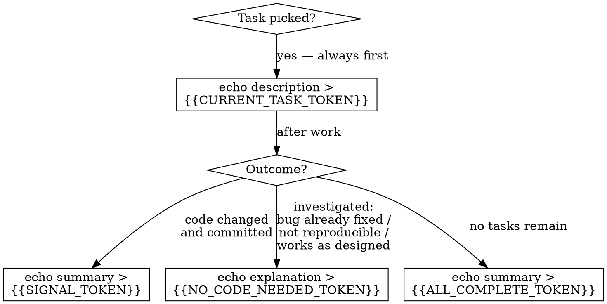

## RALPH SIGNAL PROTOCOL

Use this decision tree to pick the correct signal. Writing the wrong signal wastes an iteration.

Signal details:
- **{{CURRENT_TASK_TOKEN}}** — write immediately when you start a task.
- **{{SIGNAL_TOKEN}}** — task complete, code committed.
- **{{NO_CODE_NEEDED_TOKEN}}** — investigated and confirmed no code changes required. Use INSTEAD OF the regular completion signal.
- **{{ALL_COMPLETE_TOKEN}}** — all tasks complete, no work remains.

IMPORTANT: These are ABSOLUTE paths. You MUST use the exact paths shown above.
Do NOT use relative paths or the Write tool — use echo with the full path.
If blocked, still write the completion signal so the loop can proceed to the next iteration.

**WARNING: Writing the signal file is your FINAL action. Ralph polls for signal files and will kill your process immediately upon detection. Complete ALL work before writing — commits, pushes, PR creation, bd commands, everything. Once the signal file exists, you will be terminated.**
